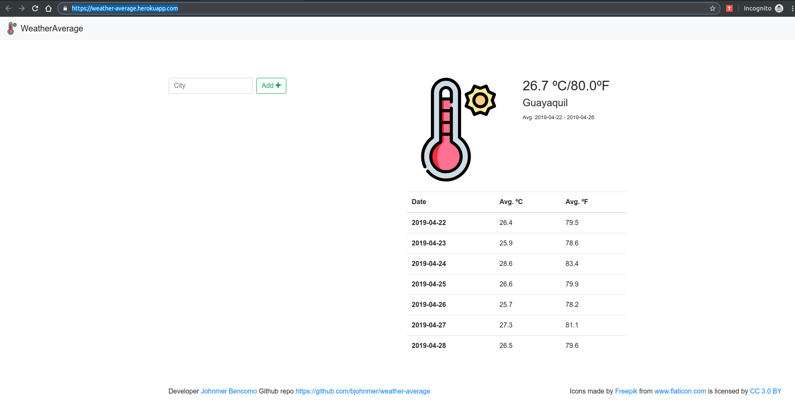
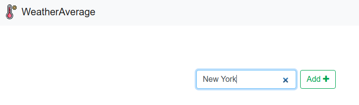
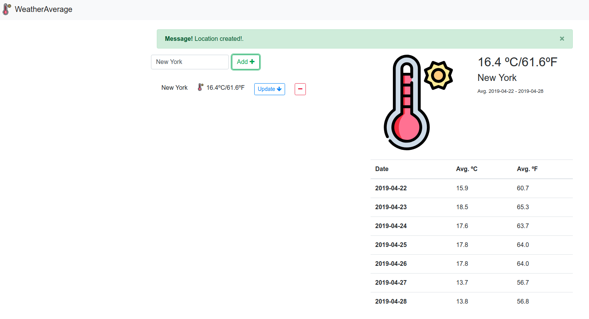
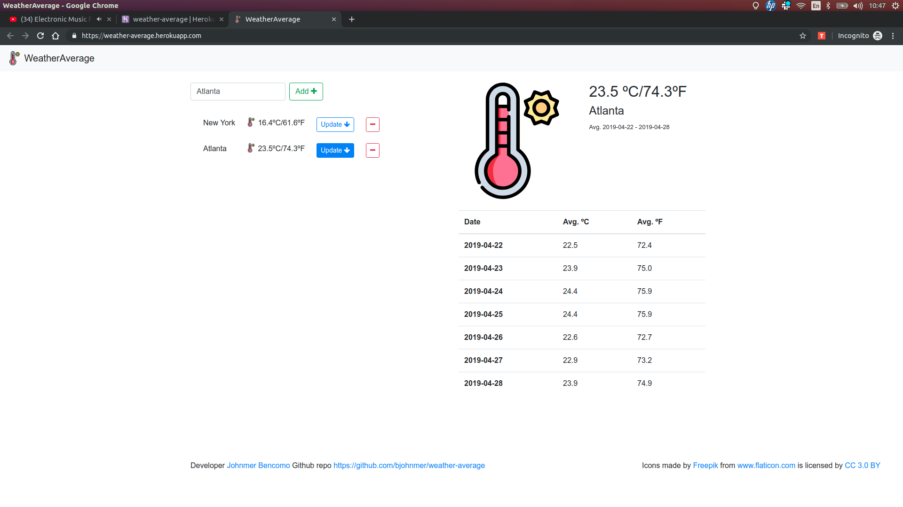

# weather-average
Is a small web app that allows to check forecast temperature average from any city worldwide

## How to:
Url: [https://weather-average.herokuapp.com/](https://weather-average.herokuapp.com/)

Just type in the text input the name of any city and click on the button `Add +`

After that, will be noticed that the city is created as an item in a personal list.

Is able to create any city that user would want to check forecast temperature average. At the right will be shown a forecast temperature table for next seven days and the average temperature.
User can check and update any city in the list just clicking on the `Update` button.

## Architecture:
- Backend Technologies:
  - Programming Language: Ruby
  - Framework: Ruby on Rails
  - Database: PostgreSQL
  - Third-party APIs: [https://www.apixu.com/](https://www.apixu.com/)
- Front-end Technologies
  - HTML/CSS Framework: [https://getbootstrap.com/](https://getbootstrap.com/) Bootstrap v4.3
  - Libraries:
    + Jquery v3
    + Axios

## Nice to have:
- Sign up feature: Register users in the webapp.
- Update all button: button to update all just in one click all cities forecast temperature average registered in the personal list.
- Live search: To be more accurate would be nice to show a list of suggested cities as user be typing.

## Code:
- [https://github.com/bjohnmer/weather-average](https://github.com/bjohnmer/weather-average)
